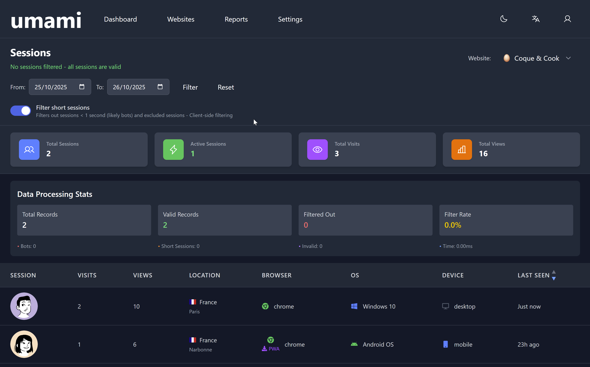

# Umami Analytics Dashboard

<div align="center">
  
</div>

A modern, self-hostable analytics dashboard built with React, TypeScript, and Tailwind CSS. Perfect for SaaS developers who want to integrate analytics directly into their admin panels.

## 🎯 Perfect For

- **SaaS Applications** - Embed analytics in your admin dashboard
- **Privacy-Focused Apps** - Self-hosted analytics without third-party tracking
- **Developer Tools** - Lightweight, customizable analytics solution
- **Internal Dashboards** - Beautiful UI ready for production use

## ✨ Features

- **🎨 Modern UI** - Dark theme with responsive design
- **📊 Real-Time Analytics** - Session tracking, visits, and page views
- **🌍 Geolocation** - Country and city-level insights
- **📱 Device Detection** - Browser, OS, and device analytics
- **🤖 Bot Filtering** - Automatic bot detection and filtering
- **⚡ Fast & Lightweight** - Built with Vite for optimal performance
- **🔒 Privacy-First** - Self-hosted, no third-party tracking
- **🎯 Type-Safe** - Full TypeScript support

## 🚀 Quick Start

### Prerequisites

- Node.js 18+ and npm
- Umami Cloud API account or self-hosted Umami instance

### Installation

1. **Clone the repository**
   ```bash
   git clone https://github.com/yourusername/umami-analytics-dashboard.git
   cd umami-analytics-dashboard
   ```

2. **Install dependencies**
   ```bash
   npm install
   ```

3. **Configure environment variables**
   
   Create a `.env` file in the project root:
   ```env
   # Umami API Configuration
   VITE_UMAMI_API_URL=https://api.umami.is/v1
   VITE_UMAMI_API_KEY=your-api-key-here
   VITE_UMAMI_WEBSITE_ID=your-website-id-here
   
   # Data Mode (mock or real)
   VITE_USE_MOCK_DATA=false
   ```

4. **Start development server**
   ```bash
   npm run dev
   ```

5. **Open your browser**
   Navigate to [http://localhost:5173](http://localhost:5173)

## 📦 Integration Options

### Option 1: Standalone Dashboard
Deploy as a separate analytics application for your admin panel.

```bash
npm run build
# Deploy the dist/ folder to your hosting provider
```

### Option 2: Embed as Component
Import the components into your existing React application:

```tsx
import { SessionsTable, SessionStats } from '@umami-analytics-dashboard/components';

function AdminDashboard() {
  return (
    <div>
      <SessionStats />
      <SessionsTable />
    </div>
  );
}
```

### Option 3: Iframe Integration
Embed as an iframe in any application:

```html
<iframe src="https://your-analytics-instance.com" 
        width="100%" 
        height="800px"
        frameborder="0">
</iframe>
```

## 🛠️ Tech Stack

| Category | Technology |
|----------|-----------|
| **Framework** | React 19 |
| **Language** | TypeScript |
| **Styling** | Tailwind CSS v4 |
| **Build Tool** | Vite |
| **Icons** | Phosphor Icons |
| **Avatars** | DiceBear Lorelei |
| **Flags** | react-country-flag |

## 📁 Project Structure

```
src/
├── api/                    # API layer & data fetching
│   ├── client/            # HTTP client with authentication
│   ├── config/            # API endpoints & configuration
│   ├── hooks/             # React hooks (useSessions, useWebsites, etc.)
│   └── types/             # TypeScript definitions
├── components/            # UI components
│   ├── SessionsTable.tsx # Main analytics table
│   ├── SessionStats.tsx  # KPI cards
│   ├── SessionAvatar.tsx # User avatars
│   └── CountryFlag.tsx    # Country visualization
├── config/                # Configuration
└── utils/                 # Helper functions
```

## 🎨 Key Components

### SessionStats
Displays key performance indicators:
- Total Sessions
- Active Sessions  
- Total Visits
- Total Views

### SessionsTable
Comprehensive session analytics with:
- User avatars (consistent generation)
- Geolocation data (country & city)
- Browser, OS, and device detection
- Time-based filtering
- Bot filtering

## 🔧 Configuration

### Environment Variables

| Variable | Description | Example |
|----------|-------------|---------|
| `VITE_UMAMI_API_URL` | Umami API endpoint | `https://api.umami.is/v1` |
| `VITE_UMAMI_API_KEY` | Your Umami API key | `api_xxx...` |
| `VITE_UMAMI_WEBSITE_ID` | Website/domain ID | `xxx-xxx-xxx` |
| `VITE_USE_MOCK_DATA` | Use mock data for dev | `true/false` |

### Data Modes

**Mock Mode** (Development):
- Uses generated test data
- No API connection required
- Perfect for UI development

**Real Mode** (Production):
- Connects to Umami API
- Live analytics data
- Requires valid API credentials

## 📱 Responsive Design

- **Desktop**: Full 4-column statistics grid
- **Tablet**: Adaptive 2-column layout
- **Mobile**: Optimized mobile experience
- **All Devices**: Horizontal scroll for tables

## 🚀 Production Deployment

### Build for Production

```bash
npm run build
```

This creates an optimized build in the `dist/` directory.

### Deploy to Vercel

```bash
npm install -g vercel
vercel
```

### Deploy to Netlify

```bash
npm install -g netlify-cli
netlify deploy
```

### Manual Deployment

Upload the contents of the `dist/` folder to any static hosting service:
- AWS S3 + CloudFront
- GitHub Pages
- Any static file server

## 🔒 Security

- API keys stored in environment variables
- No hardcoded credentials
- `.env` files gitignored by default
- Secure API communication

## 🧪 Development

### Available Scripts

```bash
npm run dev          # Start development server
npm run build        # Build for production
npm run preview      # Preview production build
npm run lint         # Run ESLint
```

### Code Quality

- ✅ TypeScript strict mode
- ✅ ESLint with TypeScript rules
- ✅ Consistent code formatting
- ✅ Comprehensive error handling

## 🤝 Contributing

Contributions are welcome! Please feel free to submit a Pull Request.

1. Fork the repository
2. Create your feature branch (`git checkout -b feature/AmazingFeature`)
3. Commit your changes (`git commit -m 'Add some AmazingFeature'`)
4. Push to the branch (`git push origin feature/AmazingFeature`)
5. Open a Pull Request

## 📄 License

This project is licensed under the MIT License.

## 🙏 Acknowledgments

- [Umami](https://umami.is/) - Privacy-focused analytics platform
- [DiceBear](https://dicebear.com/) - Avatar generation
- [Phosphor Icons](https://phosphoricons.com/) - Icon library
- [Tailwind CSS](https://tailwindcss.com/) - Utility-first CSS
- [React](https://react.dev/) - UI library

## 📞 Support

Have questions or need help?

- 📖 Check out the [documentation](./README-DATA-MODE.md)
- 🐛 Open an [issue](../../issues) on GitHub
- 💬 Start a [discussion](../../discussions)

---

**Built with ❤️ for developers who care about privacy and great UX**